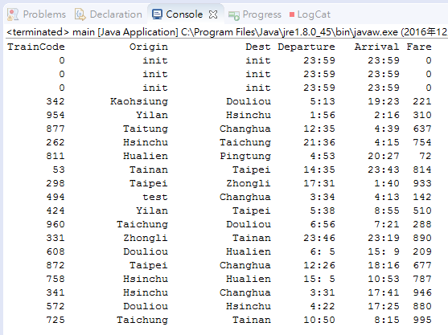

#Java HomeWork04




括號內為建議變數名稱幫你們省去想變數的困擾

完成一個火車時刻(TrainTime)的class

裡面需要定義

private:

火車編號 (trainCode)

發車站 (origin)

終點站 (dest)

開車時間 (departure)

到達時間 (arrival)

票價 (fare)

public:

有初始值的建構子

set某變數的函數, e.g, setFare(int fare);

get某變數的函數, e.g, int getFare();

撰寫 TrainTime.toString()

用途為把全部變數合成一行字串回傳

---
以下為main的程式碼
```Java
public class main {

	public static void main(String[] args) { //程式進入點
		// TODO Auto-generated method stub

		TrainTime[] trainTimes = new TrainTime[20]; //宣告20個火車時刻的物件

		for (int i = 0; i < 3; i++) { //迴圈內是在初始化物件陣列裡的陣列
			trainTimes[i] = new TrainTime(); //使用初始值的建構子
		}

		for (int i = 3; i < trainTimes.length; i++) { //這個迴圈是在初始化物件陣列裡的陣列
			trainTimes[i] = new TrainTime(randNumber(),randTrainStation(),randTrainStation(),randTime(),randTime(),randNumber()); //使用我們賦予值的建構子
		}

		trainTimes[10].setOrigin("test"); //第11個火車時刻起始站我們設定為test

		System.out.println(String.format("%9s %15s %15s %9s %9s %4s","TrainCode","Origin","Dest","Departure","Arrival","Fare")); //列印火車時刻表的第一行

		for (TrainTime trainTime : trainTimes) { //從物件陣列中取出每個物件
			System.out.println(trainTime.toString()); //列印每個物件的toString函數所回傳的數值
		}
	}

	static String randTrainStation(){ //亂數生成車站
		final String[] trainStation = {"Taipei","Banqiao","Taoyuan","Zhongli","Hsinchu","Taichung","Changhua","Douliou","Chiayi","Tainan","Kaohsiung","Pingtung","Yilan","Hualien","Taitung"};
		return trainStation[(int)(Math.random()* trainStation.length)];
	}

	static String randTime(){ //亂數生成時間
		return String.format("%2d:%2d",(int)(Math.random()*24),(int)(Math.random()*60));
	}

	static int randNumber(){ //亂數生成整數
		return (int)(Math.random()*999)+1;
	}
}
```

---
以下為TrainTime.class的程式碼 程式碼不一樣沒關係 功能正常就好
```Java
public class TrainTime {
	private int trainCode; //火車編號
	private String origin; //發車站
	private String dest; //終點站
	private String departure; //開車時間
	private String arrival; //到達時間
	int fare; //票價
	
//	trainTimes[i] = new TrainTime(); 這行會呼叫他↓↓
	public TrainTime(){ //初始值的建構子
		this.trainCode = 0000;
		this.origin = "init";
		this.dest = "init";
		this.departure = "23:59";
		this.arrival = "23:59";
		this.fare = 0;
	}


//	trainTimes[i] = new TrainTime(randNumber(),randTrainStation(),randTrainStation(),randTime(),randTime(),randNumber()); 這行會呼叫他↓↓
	public TrainTime(int trainCode, String origin, String Dest, String departure, String arrival, int fare) { //使用我們賦予值的建構子
		this.trainCode = trainCode;
		this.origin = origin;
		this.dest = Dest;
		this.departure = departure;
		this.arrival = arrival;
		this.fare = fare;
	}

//	trainTime.toString() 這行會呼叫他↓↓
	public String toString(){
		return String.format("%9s %15s %15s %9s %9s %4s",trainCode,origin,dest,departure,arrival,fare);
	}

	//下面這個我只是用 "自動生成" 做出來的 我有放到共筆上喔
	public int getTrainCode() {
		return trainCode;
	}

	public void setTrainCode(int trainCode) {
		this.trainCode = trainCode;
	}

	public String getOrigin() {
		return origin;
	}

	public void setOrigin(String origin) {
		this.origin = origin;
	}

	public String getDest() {
		return dest;
	}

	public void setDest(String dest) {
		this.dest = dest;
	}

	public String getDeparture() {
		return departure;
	}

	public void setDeparture(String departure) {
		this.departure = departure;
	}

	public String getArrival() {
		return arrival;
	}

	public void setArrival(String arrival) {
		this.arrival = arrival;
	}

	public int getFare() {
		return fare;
	}

	public void setFare(int fare) {
		this.fare = fare;
	}
}
```

---
以下為 黃O景 的程式碼 那個this的使用很精彩 可以提高程式的利用性
```Java
	public TrainTime() { //這邊的 this 會去呼叫到下面的建構子 這樣寫好像可以達到程式碼的高內聚?!
		this(233, "Taipei", "Banqiao", "12:30", "18:30", 762);
	}

	public TrainTime(int tra, String ori, String des, String dep, String arr, int fat) {
		setTrainCode(tra);
		setOrigin(ori);
		setDest(des);
		setDeparture(dep);
		setArrival(arr);
		setFate(fat);
	}```
