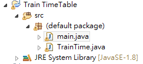

#Java HomeWork04



括號內為建議變數名稱幫你們省去想變數的困擾

完成一個火車時刻(TrainTime)的class

裡面需要定義

private:

火車編號 (trainCode)

發車站 (origin)

終點站 (dest)

開車時間 (departure)

到達時間 (arrival)

票價 (fare)

public:

有初始值的建構子

set某變數的函數, e.g, setFare(int fare);

get某變數的函數, e.g, int getFare();

撰寫 TrainTime.toString()

用途為把全部變數合成一行字串回傳

---
以下為main的程式碼
```Java
public class main {

	public static void main(String[] args) { //程式進入點
		// TODO Auto-generated method stub

		TrainTime[] trainTimes = new TrainTime[20]; //宣告20個火車時刻的物件

		for (int i = 0; i < 3; i++) { //迴圈內是在初始化物件陣列裡的陣列
			trainTimes[i] = new TrainTime(); //使用初始值的建構子
		}

		for (int i = 3; i < trainTimes.length; i++) { //這個迴圈是在初始化物件陣列裡的陣列
			trainTimes[i] = new TrainTime(randNumber(),randTrainStation(),randTrainStation(),randTime(),randTime(),randNumber()); //使用我們賦予值的建構子
		}

		trainTimes[10].setOrigin("test"); //第11個火車時刻起始站我們設定為test

		System.out.println(String.format("%9s %15s %15s %9s %9s %4s","TrainCode","Origin","Dest","Departure","Arrival","Fare")); //列印火車時刻表的第一行

		for (TrainTime trainTime : trainTimes) { //從物件陣列中取出每個物件
			System.out.println(trainTime.toString()); //列印每個物件的toString函數所回傳的數值
		}
	}

	static String randTrainStation(){ //亂數生成車站
		final String[] trainStation = {"Taipei","Banqiao","Taoyuan","Zhongli","Hsinchu","Taichung","Changhua","Douliou","Chiayi","Tainan","Kaohsiung","Pingtung","Yilan","Hualien","Taitung"};
		return trainStation[(int)(Math.random()* trainStation.length)];
	}

	static String randTime(){ //亂數生成時間
		return String.format("%2d:%2d",(int)(Math.random()*24),(int)(Math.random()*60));
	}

	static int randNumber(){ //亂數生成整數
		return (int)(Math.random()*999)+1;
	}
}
```
